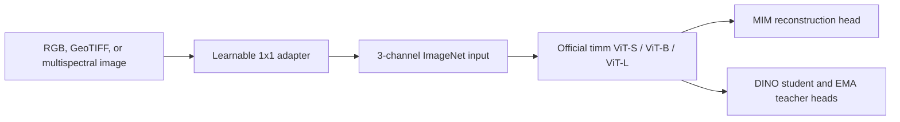

# AG Foundational Model

Research-grade self-supervised pretraining for agricultural imagery using official
Vision Transformer backbones, selectable ImageNet/DINOv2/DINOv3/MAE initialization,
RGB/GeoTIFF/multispectral inputs, and reproducible MIM and DINO training pipelines.

## Highlights

- Official `timm` ViT-S, ViT-B, and ViT-L backbones
- Selectable ImageNet, DINOv2, DINOv3, and MAE official checkpoints
- Learnable 1x1 input adapter on every model
- RGB, multiband GeoTIFF, NPY, folder, ZIP, and nested-ZIP loading
- MAE-style masked image modeling
- DINO-style student-teacher continual pretraining from official checkpoints
- Live batch and epoch metrics in the terminal
- Per-epoch loss curves and model-output visualizations
- Best/latest checkpoints with optimizer, config, and RNG state
- Atomic checkpoint/metric writes and immutable per-attempt manifests
- Append-only command logs and complete run manifests
- Portable YAML paths, catalogs, shell scripts, and PowerShell scripts
- Deterministic RGB and five-band demo data for fresh-clone verification

## Architecture



The adapter is identity-initialized for RGB. For multispectral input, its first
available channels initialize the three ViT channels and all remaining spectral
weights start at zero but remain trainable. This gives the official ImageNet ViT
a stable RGB-like starting point while allowing every band to contribute during
continual pretraining.

## Fresh Clone Quick Start

The commands below exercise the complete package without requiring an external
agricultural dataset.

```bash
git clone <repository-url>
cd AG_Foundational_Model

python3 -m venv .venv
source .venv/bin/activate
python -m pip install --upgrade pip
python -m pip install -e '.[dev,ml]'

python -m ag_foundation create-demo-data
python -m ag_foundation train-mim --config configs/demo_mim.yaml
python -m ag_foundation train-dino --config configs/demo_dino.yaml
python -m pytest -q
```

The first pretrained run may download official ImageNet, DINOv2, DINOv3, or
MAE weights through `timm` and Hugging Face Hub. Later runs use the local model
cache.

For the complete operational sequence, expected outputs, RTX 4090 settings, and
post-training research checklist, see [Project runbook and audit report](docs/runbook.md).

### Windows PowerShell

```powershell
git clone <repository-url>
Set-Location AG_Foundational_Model

py -3.11 -m venv .venv
.\.venv\Scripts\Activate.ps1
python -m pip install --upgrade pip
python -m pip install -e ".[dev,ml]"

python -m ag_foundation create-demo-data
.\scripts\train_mim.ps1 --config .\configs\demo_mim.yaml
.\scripts\train_dino.ps1 --config .\configs\demo_dino.yaml
python -m pytest -q
```

## Train On Real Data

Copy an example config and change only the data and output locations:

```bash
cp configs/train_mim.example.yaml configs/my_mim.yaml
cp configs/train_dino.example.yaml configs/my_dino.yaml
```

Then run:

```bash
bash scripts/train_mim.sh --config configs/my_mim.yaml
bash scripts/train_dino.sh --config configs/my_dino.yaml
```

Direct package commands are equivalent and are also logged:

```bash
python -m ag_foundation train-mim --config configs/my_mim.yaml
python -m ag_foundation train-dino --config configs/my_dino.yaml
```

Use `model_name: S`, `B`, or `L` in YAML. Select the official checkpoint family
with `pretrained_source`:

```yaml
model:
  model_name: B
  pretrained_backbone: true
  pretrained_source: mae
```

`pretrained_source` accepts `imagenet`, `dinov2`, `dinov3`, or `mae`. DINOv2
uses patch size 14, while ImageNet, DINOv3, and MAE use patch size 16. Pick a
crop size divisible by the selected patch size.

For a single RTX 4090, start with `precision: bf16`, `batch_size: 4` to `8`,
`gradient_accumulation_steps: 2` or higher as needed, and
`gradient_checkpointing: true` for ViT-B or ViT-L runs. The shipped example
configs already show that pattern.

To continue from a previous SSL stage without resuming optimizer state, set
`runtime.initialize_from` to the earlier `last.pt`. That is the clean way to do
MIM → DINO continual pretraining.

## Input Data

Supported payloads:

- RGB: `.jpg`, `.jpeg`, `.png`
- GeoTIFF: `.tif`, `.tiff`, including arbitrary band counts
- Arrays: `.npy` in `C,H,W` or `H,W,C` layout
- Containers: directories, `.zip`, and nested `.zip`

Set `data.channels` to the exact input band count. Non-negative integer rasters
are scaled by their dtype range. Floating rasters must already be finite and
normalized to `[0, 1]`.

Create a portable catalog:

```bash
python -m ag_foundation create-catalog \
  --data-root /data/agriculture.zip \
  --output-path catalogs/agriculture.csv
```

Slice large GeoTIFF scenes into georeferenced tiles:

```bash
python -m ag_foundation slice-geotiffs \
  --input-path /data/scenes \
  --output-dir /data/tiles \
  --tile-size 224 \
  --stride 224 \
  --output-format tif
```

## Audit The Pretraining Dataset

After updating the sibling `Pretraining/` directory or `Pretraining/Dataset.txt`,
regenerate the dataset audit:

```bash
python scripts/analyze_pretraining_dataset.py \
  --pretraining-root ../Pretraining \
  --dataset-list ../Pretraining/Dataset.txt \
  --output-dir reports/pretraining_dataset_audit
```

The audit writes Markdown, JSON, and CSV reports with local image counts, format
mix, manifest coverage, likely image/task types, missing sources, and recommended
dataset additions. The current audit found 412,454 image-like files across 13
local ZIP datasets, with no local GeoTIFF/NPY multispectral files detected.

## Live Metrics And Outputs

Training prints batch loss, running loss, learning rate, validation loss, epoch
duration, and artifact paths while the model is running. Metrics and plots are
flushed after every epoch, not only when training finishes.

Each run has this structure:

```text
runs/<run-name>/
|-- best.pt
|-- last.pt
|-- metrics.csv
|-- metrics.json
|-- run_manifest.json
|-- resolved_config.yaml
|-- model_summary.txt
|-- command.txt
|-- attempts/
|   `-- <timestamp>/
|       |-- run_manifest.json
|       |-- resolved_config.yaml
|       |-- model_summary.txt
|       `-- command.txt
|-- figures/
|   |-- training_metrics.png
|   |-- mim_reconstruction_latest.png
|   |-- dino_views_latest.png
|   `-- dino_similarity_latest.png
`-- diagnostics/
    `-- dino_similarity_epoch_XXXX.csv
```

MIM runs save adapted inputs, masks, and reconstructions. DINO runs save
multi-crop views plus student-teacher feature similarity matrices. Files that do
not apply to the selected method are omitted.

Checkpoints preserve:

- model weights
- optimizer and optional scheduler state
- gradient scaler state
- complete training history
- best metric
- resolved training arguments
- Python, NumPy, Torch, CUDA, and MPS RNG state when available
- DataLoader generator state

## Logging

All CLI commands and wrappers append stdout and stderr to `command.log` in the
current working directory by default. Each entry records the command, working
directory, PID, timestamps, duration, and exit status.

```bash
python -m ag_foundation train-mim \
  --config configs/my_mim.yaml \
  --log-file runs/my_mim/command.log
```

Disable command logging for one invocation with `--no-log`.

## Resume Training

Set `runtime.resume: true` to use `<output_dir>/last.pt` when it exists, or pass
an explicit checkpoint:

```bash
python -m ag_foundation train-mim \
  --config configs/my_mim.yaml \
  --epochs 100 \
  --resume-from runs/my_mim/last.pt
```

`epochs` is the final target epoch, not the number of additional epochs.

## Repository Layout

```text
configs/                 Portable experiment configurations
data/                    Generated/local data; payloads are gitignored
docs/                    Design, operation, and research documentation
scripts/                 macOS/Linux and Windows launchers
src/ag_foundation/data/  Dataset, catalog, archive, and GeoTIFF code
src/ag_foundation/models/Adapter, official ViT, MIM, and DINO models
src/ag_foundation/training/
                         Trainers, visualization, state, and manifests
tests/                   Unit and integration-style tests
```

## Documentation

- [Documentation index](docs/README.md)
- [Installation and portability](docs/setup.md)
- [Project runbook and audit report](docs/runbook.md)
- [Architecture and design choices](docs/architecture.md)
- [Data formats and catalog contract](docs/data-formats.md)
- [Configuration reference](docs/configuration.md)
- [Training workflows](docs/training.md)
- [Experiment tracking and artifacts](docs/experiment-tracking.md)
- [Reproducibility](docs/reproducibility.md)
- [Dataset audit and gaps](docs/dataset-strategy.md)
- [Candidate dataset registry](Dataset.yml)
- [Testing and verified workflows](docs/testing.md)
- [Troubleshooting](docs/troubleshooting.md)
- [Publication roadmap](docs/research-roadmap.md)
- [Research project description](project_description.md)

After placing the project in a Git repository, `.github/workflows/ci.yml`
automatically verifies installation and tests on Linux, macOS, and Windows.

## Current Verification

The repository has been tested with:

- package installation through `pip install -e .`
- `64 passed` in the full automated test suite with rasterio available
- official pretrained ViT-S MIM on five-band NPY input
- official pretrained ViT-S DINO on RGB and five-band NPY input
- two-epoch checkpoint resume for both objectives
- Apple MPS execution
- portable archive-member catalogs
- artifact and checkpoint reload inspection

The demo configs verify engineering correctness only. They are intentionally
small and are not scientific baselines or publication results.
