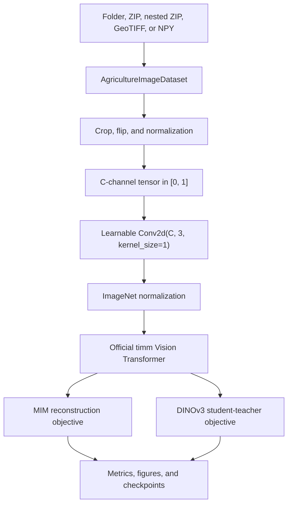

# Architecture

## System Boundary

The project is a reusable agricultural image pretraining package. It is not a
notebook-specific model and it does not define a custom transformer.

## Official Backbones

| Config | `timm` model | Patch | Embedding |
| --- | --- | ---: | ---: |
| `S` | `vit_small_patch16_224` | 16 x 16 | 384 |
| `B` | `vit_base_patch16_224` | 16 x 16 | 768 |
| `L` | `vit_large_patch16_224` | 16 x 16 | 1024 |

The configured crop size must be divisible by 16. Positional embeddings are
interpolated to the runtime patch grid, so the backbone can train at compatible
resolutions other than 224.

## ImageNet Initialization

`timm.create_model` constructs the official backbone with:

- `pretrained=True` by default
- classifier removed with `num_classes=0`
- token output retained with `global_pool=""`
- configured dropout and stochastic-depth values

The pretrained model's mean and standard deviation are registered and applied
after the band adapter. This preserves the expected input distribution for the
official RGB weights.

## 1x1 Band Adapter

The adapter is `Conv2d(in_channels, 3, kernel_size=1)`.

For RGB:

- the adapter is still present
- weights start as a 3 x 3 identity mapping
- bias starts at zero
- the layer may adapt during continual pretraining

For multispectral input:

- the first available input channels initialize the three outputs
- additional spectral-band weights start at zero and remain trainable
- each output channel can learn a linear mixture of all sensor bands
- spatial resolution and geospatial alignment are unchanged
- the official ViT remains a three-channel model

This adapter is deliberately simple. It isolates sensor adaptation from the
transformer and creates a clear ablation against RGB-only and alternative
spectral adapters.

## MIM Path

1. Adapt input bands to RGB-like channels.
2. Patchify through the official ViT patch projection.
3. Sample a random binary patch mask.
4. Replace masked patch tokens with a learned mask token.
5. add interpolated positional embeddings.
6. Encode visible and masked positions with the ViT blocks.
7. Reconstruct three-channel patch pixels with a linear head.
8. Compute mean squared error only over masked patches.

The default mask ratio is `0.75`.

## DINO Path

1. Adapt input bands with separate student and teacher adapters.
2. Replay identical random global-crop parameters for the two branches.
3. Produce additional local views for the student only.
4. Encode all student views.
5. Encode global teacher views without gradients.
6. Match centered, temperature-scaled teacher probabilities.
7. Update teacher adapter, backbone, and head using exponential moving average.
8. Update the teacher-output center.
9. Regularize dense patch similarities with Gram anchoring on aligned global views.

The complete teacher image encoder is initialized as an exact copy of the
ImageNet-initialized student and remains frozen to gradient updates. Legacy
checkpoints created with the earlier shared `adapter.*` layout migrate
automatically when loaded.

This is a DINOv3-style continual-pretraining implementation. It adds Gram
anchoring on dense features and a constant-momentum training path while keeping
the official ViT S/B/L backbones and 1x1 adapter design. A full paper
reproduction would still require the large-scale training, post-hoc distillation
suite, and scaling recipe described in the DINOv3 report, so those remain
roadmap items rather than hidden claims.

## Precision And Devices

The trainers use device-aware autocast and CUDA gradient scaling. Model outputs
and gradients are checked for finite values; invalid gradients stop the run
instead of being silently replaced. CUDA, MPS, and CPU are supported.

## Distributed Data

When `torch.distributed` is initialized externally, the data factory uses
`DistributedSampler` and calls `set_epoch` each epoch. The current launchers do
not initialize a distributed process group; multi-node launch orchestration is
a future scaling task.
